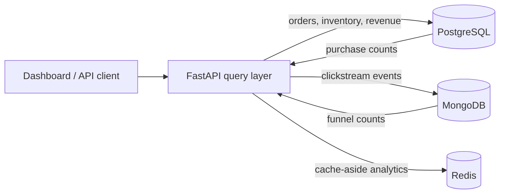

# Commerce Data Platform

Commerce Data Platform combines an ACID order system with high-volume behavioral events and exposes both through a unified analytics dashboard.


## Overview

The system separates workloads according to their consistency, structure, and access requirements:

- **PostgreSQL is the system of record** for customers, products, inventory, orders, and line items. Foreign keys, check constraints, exact decimals, and serializable transactions protect money and stock.
- **MongoDB is the event store** for variable-shaped clickstream documents. New event properties can be added without migrating the transactional schema.
- **Redis is the derived-data layer** for short-lived funnel results. It improves read latency without becoming a source of truth.

## Run it

Prerequisite: Docker Desktop with Docker Compose.

```bash
docker compose up --build -d
python scripts/seed.py
```

Then open:

- Dashboard: http://localhost:8000
- Interactive API: http://localhost:8000/docs
- Health check: http://localhost:8000/health

Stop services with `docker compose down`. To reset all data and rerun initialization, use `docker compose down -v` and then start again.

## Architecture



The API is the consistency boundary between stores. No distributed transaction is attempted: business-critical writes stay entirely in PostgreSQL, while events are independently retryable and idempotent. See [architecture.md](docs/architecture.md) for the reasoning and failure modes, and [data-model.md](docs/data-model.md) for the ER diagram and document shape.

## Key implementation details

- Atomic checkout with `SERIALIZABLE` isolation, `SELECT ... FOR UPDATE`, deterministic lock order, and database-enforced nonnegative inventory.
- Monetary history protected by copying the sale price into `order_items.unit_price`.
- Idempotent MongoDB event ingestion through a unique `event_id` index.
- MongoDB aggregation pipeline for event counts and SQL aggregation for paid orders.
- Cache-aside analytics with explicit invalidation after payment and a TTL safety net.
- Partial covering PostgreSQL index focused on paid revenue queries.
- Compound event indexes for per-customer and per-session timelines.
- Schema validation in the API, PostgreSQL, and MongoDB rather than trusting one layer.
- Health endpoint that verifies all three database connections.
- Responsive dashboard and OpenAPI documentation.

## Data ownership

| Concern | Source of truth | Reason |
|---|---|---|
| Customers and products | PostgreSQL | Relationships and uniqueness constraints |
| Orders and inventory | PostgreSQL | Multi-row atomicity and referential integrity |
| Behavioral events | MongoDB | High write volume and evolving document shapes |
| Funnel response | Redis cache | Cheap recomputation; safe to evict |

## API tour

```bash
# List the deterministic product catalog
curl http://localhost:8000/api/products

# Create a customer
curl -X POST http://localhost:8000/api/customers \
  -H "Content-Type: application/json" \
  -d '{"email":"you@example.com","name":"Your Name","country_code":"US"}'

# Inspect a cross-database funnel (call twice to observe cache miss -> hit)
curl "http://localhost:8000/api/analytics/funnel?days=30"
```

Use the interactive docs for order and event payloads.

## Development without containers

If PostgreSQL, MongoDB, and Redis are already running locally:

```bash
python -m venv .venv
.venv\Scripts\activate      # Windows
pip install -e ".[dev]"
copy .env.example .env      # change hostnames to localhost
uvicorn app.main:app --reload
pytest -q
ruff check .
```

The normal path is Docker Compose because it also applies the database validators, indexes, and seed data.

## Repository map

```text
app/
  repositories/       database-specific queries
  services/           cross-store analytics and caching
  routers/            HTTP endpoints
db/
  postgres/           relational DDL, indexes, seed data, query examples
  mongo/              collection validator, indexes, seed events
docs/                  architecture and data-model documentation
scripts/seed.py        deterministic end-to-end demo data
static/                dashboard
tests/                 schema and service tests
```

## Next production steps

- Use Alembic migrations instead of initialization scripts.
- Add an outbox table plus message broker for durable order-to-event propagation.
- Authenticate users and apply rate limits to ingestion.
- Add OpenTelemetry traces and database latency/error dashboards.
- Partition the event collection by time or shard key after measuring workload.
- Run integration tests against ephemeral containers in CI.
