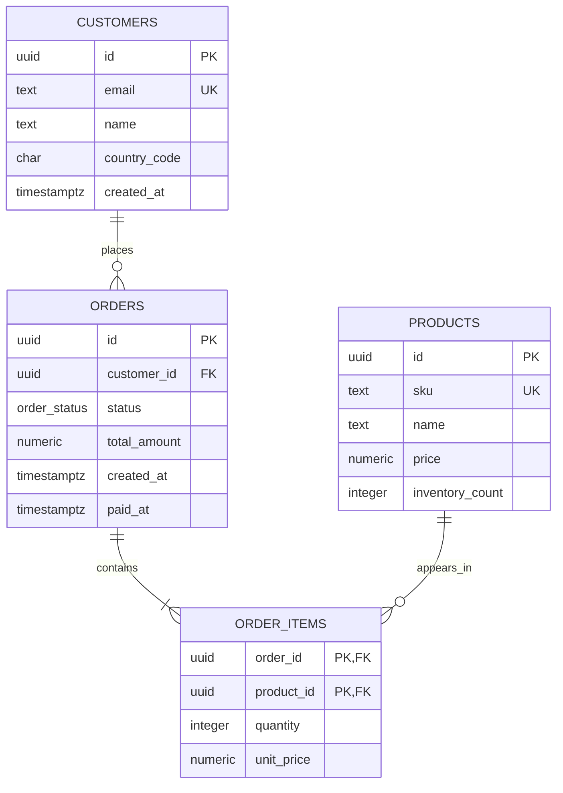

# Data model

## Relational core



`order_items` is an associative entity with a composite primary key. Its `unit_price` is a historical snapshot rather than a live reference to `products.price`. `orders.total_amount` is also stored rather than calculated on every read; the transaction is responsible for writing the matching value.

UUID primary keys make client-visible identifiers hard to enumerate and allow independent producers, at the cost of wider indexes and weaker insertion locality than sequential integers. UUIDv7 would be a good production improvement for index locality.

## Event document

```json
{
  "event_id": "9e43c419-7580-47bb-b28e-b07fcf811f24",
  "customer_id": "10000000-0000-4000-8000-000000000001",
  "session_id": "session-2026-09-24-001",
  "event_type": "product_view",
  "occurred_at": "2026-09-24T14:31:22Z",
  "ingested_at": "2026-09-24T14:31:23Z",
  "properties": {
    "product_id": "00000000-0000-4000-8000-000000000001",
    "referrer": "search",
    "experiment": "new-checkout-b"
  }
}
```

The envelope is stable and validated. `properties` is open by design. `occurred_at` records client event time; `ingested_at` records server receipt time, allowing latency analysis and late-event policies later.

There is no cross-database foreign key on `customer_id` or `product_id`. Analytics code must tolerate anonymous users, deleted catalog entries, and late events. This is an explicit consequence of separate ownership boundaries.

